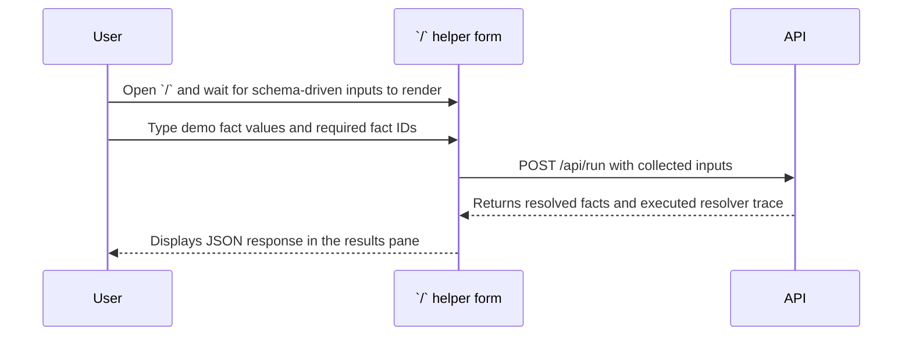

# Demo UI Mermaid Overviews

The following Mermaid diagrams reflect the current interactive helper form at `/` and the user story for exercising the demo API directly from that page.

## Helper form layout
```mermaid
flowchart TB
    start([Open `/` helper form]) --> fetchSchema[Fetch schema from /api/schema]
    fetchSchema --> groups{Rendered inputs}
    groups --> demoFacts[Demo facts:<br/>- DemoFacts.USER_NAME<br/>- DemoFacts.USER_ID<br/>- DemoFacts.FAVORITE_COLOR]
    groups --> vectorFacts[Vector-scalar facts:<br/>- vector_scalar.user_batch_relation<br/>- vector_scalar.user_records<br/>- vector_scalar.user_count<br/>- vector_scalar.primary_user_name<br/>- vector_scalar.primary_user_email<br/>- vector_scalar.primary_user_as_relation]
    groups --> required[Required facts textbox (comma-separated)]
    groups --> action[Run demo button triggers /api/run]
    action --> result[Results pane shows facts + executed resolver trace]
```

## User story for running the demo

